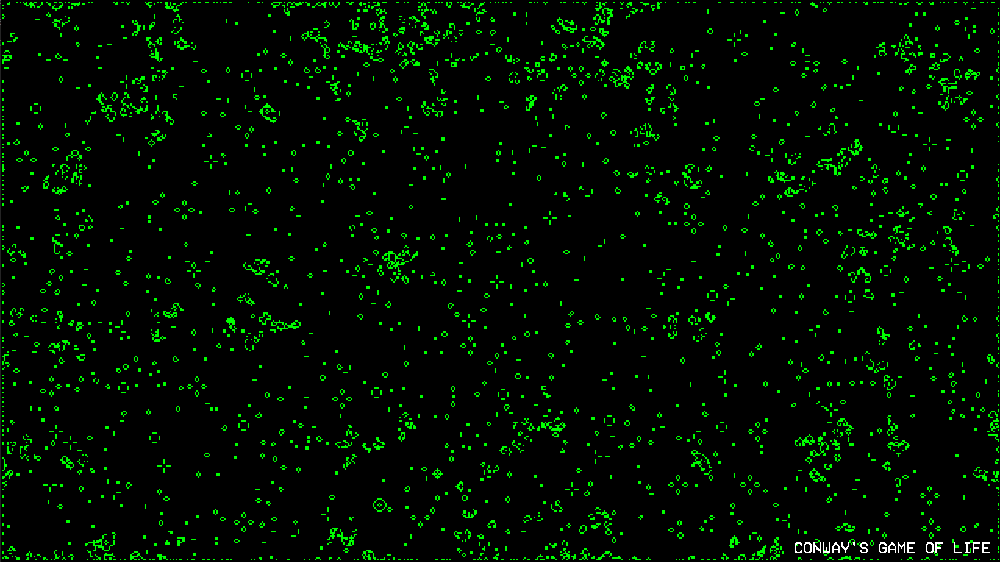

# Conway's Game of Life

This project uses [SFML (64-bit) with Visual Studio](https://www.sfml-dev.org/tutorials/2.5/start-vc.php "SFML"). To compile using Visual Studio, create an environment variable called **SFML64_SDK** that points to your SFML library install location.

Alternatively, you can simply run the **game-of-life.exe** file included in this repository.

It's not actually a game, it's [cellular automata](https://en.wikipedia.org/wiki/Cellular_automaton "Cellular automaton").\n\nNo controls, just let it run and watch the creation of life.

| Key | Action  |
| ------------ | ------------ |
|  ESC | Exit application |

*Alan B, 2021*